<picture>
  
</picture>

## Architecture decisions
- containerized services. 
- `keycloak` (manage user authentication, registration and sessions).
- `API` protected by authentication middleware. 
- 2 layers of `private networks`. 
- `nginx` redirects domain access to internal services. 
- dockerfiles supports three environments: `local`, `development`, and `production`. 
- frontends are provisioned by `cloudfront`. 
- special `admin` frontend for easy UI management. 
- `monorepo` sharing dependencies between multiple modules.

 

## Development environment
- the development environment uses a mock domain (`nanithefuck.local`) and supports flexible service execution: each service can run either inside a Docker container or as a local process while still maintaining full communication between components. **Obs: must be config on local machine DNS**

 

## API - backend
- project lifecycle control. Non blocking dependencies loading for local environment and blocking promises for production environment. 
- for testing, each test suite uses an in-memory MongoDB instance to ensure realistic query behavior without external dependencies. Entities are generated using customizable mocks with fake data, which can be overridden with specific fields. This approach makes it easy to reproduce very specific scenarios and focus only on the fields that matter. 
- Tests validate each endpoint’s input and output using Zod schemas, and then assert that the declared TypeScript types are compatible with the runtime data structure. This is important because TypeScript types and actual runtime values are fundamentally different, and both need to be verified. 

 

## Monorepo
A monorepo was chosen to enable shared packages across multiple projects, making it easier to keep entity structures and types synchronized.

This setup is a key enabler for migrating legacy systems. It allows legacy and modern codebases to coexist within the same repository, while sharing common entities and contracts. 

As a result, the system supports incremental or partial migration, where parts of the legacy code can be progressively replaced without breaking compatibility. Shared contracts ensure both old and new implementations remain aligned during the transition, reducing integration risk and improving long-term maintainability. 
